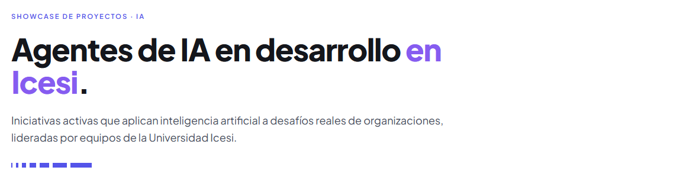

# Showcase de Agentes de IA · Universidad Icesi



Galería estática que documenta los agentes de inteligencia artificial en desarrollo en la Universidad Icesi. Pensada para presentación presencial (pantalla grande) y exploración individual.

Coordinación de Proyectos · IA.

---

## Stack

- **Astro 6** — sitio estático, contenido vía colecciones tipadas.
- **Tailwind CSS v4** — estilos vía `@theme` en CSS, sin archivo de config.
- **MDX** — descripciones extendidas por agente.
- **Plus Jakarta Sans** — tipografía institucional (manual de marca Icesi).
- **Sin JavaScript de cliente** — 0 islas, todas las páginas pre-renderizadas.

Diseño basado en el manual de identidad de marca de Icesi: paleta principal Azul Icesi `#5454e9`, complementaria (morado, amarillo, verde, naranja, grises), recurso visual *cenefa* para divisores y fallback de video.

---

## Requisitos

- Node.js `>= 22.12`
- npm `>= 10`

> Si usas `nvm`, el repo incluye `.nvmrc` apuntando a Node 22. Ejecuta `nvm use` antes de instalar.

---

## Comandos

| Comando           | Acción                                          |
| ----------------- | ----------------------------------------------- |
| `npm install`     | Instala dependencias                            |
| `npm run dev`     | Servidor local en `http://localhost:4321`       |
| `npm run build`   | Genera sitio estático en `./dist/`              |
| `npm run preview` | Sirve el build localmente para verificarlo      |
| `npm run check`   | Valida tipos y contenido (`astro check`)        |

---

## Estructura del proyecto

```
.
├── public/
│   └── brand/                  # logos Icesi (positivo / negativo)
│       ├── icesi-positivo.svg
│       └── icesi-negativo.svg
├── src/
│   ├── content/
│   │   └── agents/             # un .mdx por agente
│   ├── content.config.ts       # esquema Zod del frontmatter
│   ├── components/
│   │   ├── AgentCard.astro
│   │   ├── Cenefa.astro
│   │   ├── Footer.astro
│   │   ├── Header.astro
│   │   └── VideoFrame.astro
│   ├── layouts/
│   │   └── BaseLayout.astro
│   ├── pages/
│   │   ├── index.astro         # galería
│   │   └── agents/[slug].astro # detalle por agente
│   └── styles/
│       └── global.css          # tokens de marca + utilidades
├── astro.config.mjs
└── package.json
```

---

## Gestión de agentes

Cada agente es un archivo `.mdx` en `src/content/agents/`. El **nombre del archivo** se convierte en el slug de la URL: `src/content/agents/sarlaft.mdx` → `/agents/sarlaft/`.

### Esquema del frontmatter

```yaml
---
name: "Nombre del agente"            # requerido — string
summary: "Una línea (≤140 caracteres)"  # requerido — texto del card
description: "Párrafo más extenso."  # requerido — lead del detalle

team: ["Persona 1", "Persona 2"]     # opcional — array de strings
videoUrl: "https://…"                # opcional — embed remoto
videoLocal: "/videos/agente.mp4"     # opcional — archivo en public/videos/
cover: "/covers/agente.jpg"          # opcional — imagen poster (si no hay video se muestra como portada)
updated: 2026-05-08                  # opcional — fecha (YYYY-MM-DD)
---

### Sección libre en MDX

Cualquier contenido que quieras documentar más allá de la descripción.

- Sprints
- Próximos pasos
- Hallazgos
- Decisiones de diseño
```

> **Importante**: solo `name`, `summary` y `description` son obligatorios. Todo lo demás es opcional. Validación tipada por Zod en `src/content.config.ts`; si falta un campo requerido o el formato es inválido, el build falla con mensaje preciso.

### Añadir un agente nuevo

1. Crea `src/content/agents/<slug>.mdx`. Usa kebab-case sin acentos: `gestion-proyectos.mdx`, no `Gestión Proyectos.mdx`.
2. Llena el frontmatter mínimo.
3. (Opcional) escribe contenido en MDX debajo del `---`.
4. Guarda. El servidor de desarrollo recarga automáticamente. El agente aparece en el grid ordenado alfabéticamente por `name`.

### Editar un agente

Modifica el archivo `.mdx` correspondiente. No hay paso intermedio — el cambio es visible al recargar.

### Eliminar un agente

Borra el archivo `.mdx`. El build siguiente lo elimina del sitio.

---

## Videos

El sistema reconoce automáticamente la fuente del video por la URL. Pega la URL completa en `videoUrl`; el componente `VideoFrame` decide cómo empotrarlo.

### Fuentes soportadas

| Fuente                | Formato esperado                                                                  |
| --------------------- | --------------------------------------------------------------------------------- |
| **YouTube**           | `https://youtu.be/XXXXXXXXXXX` o `https://youtube.com/watch?v=XXXXXXXXXXX`        |
| **Vimeo**             | `https://vimeo.com/123456789`                                                     |
| **SharePoint Stream** | URL `embed.aspx?UniqueId=...` (ver más abajo)                                     |
| **Microsoft Stream**  | `https://web.microsoftstream.com/embed/...`                                       |
| **Loom**              | `https://www.loom.com/embed/...`                                                  |
| **Google Drive**      | `https://drive.google.com/file/d/<ID>/preview`                                    |
| **Archivo local**     | usa `videoLocal: "/videos/archivo.mp4"` y deja `videoUrl` sin definir             |

Si no se define ningún video, el card del grid y el detalle muestran la **cenefa decorativa azul Icesi** como fallback institucional.

### Cómo obtener el embed correcto de SharePoint Stream

SharePoint expone dos URLs distintas:

- `https://…sharepoint.com/:v:/g/personal/…/IQAS…`  → **enlace de compartir** (no empotra)
- `https://…sharepoint.com/personal/…/_layouts/15/embed.aspx?UniqueId=…`  → **enlace de inserción** (sí empotra)

Para conseguir el segundo:

1. Abre el video en SharePoint Stream.
2. Click en **Compartir** (o **Share**).
3. En el panel, busca **Insertar** o **Embed** → **Copiar código de inserción**.
4. Del `<iframe src="..."></iframe>` que aparece, copia **solo** el valor del atributo `src`.
5. Pégalo en `videoUrl` del frontmatter.

> Si pegas el enlace de compartir por error, la página no se rompe: muestra un panel azul claro con instrucciones y un botón "Abrir video en SharePoint".

### Video local (archivo MP4)

1. Coloca el archivo en `public/videos/` (crea la carpeta si no existe).
2. En el frontmatter:
   ```yaml
   videoLocal: "/videos/sarlaft.mp4"
   cover: "/covers/sarlaft.jpg"   # opcional — poster antes del play
   ```
3. Formato recomendado: H.264 + AAC en `.mp4`, ≤ 50 MB. Para archivos más pesados prefiere SharePoint Stream o YouTube no listado.

---

## Imagen de portada (`cover`)

El campo `cover` apunta a una imagen estática usada como:

- **Poster** del `<video>` cuando hay `videoLocal`.
- **Imagen del card** en el grid cuando **no** hay video (en lugar de la cenefa).

### Cómo añadir un cover

1. Coloca la imagen en `public/covers/` (crea la carpeta si no existe).
2. Referénciala desde `cover: "/covers/<archivo>.<ext>"`.

### Recomendaciones

- Aspect ratio **16:9** (ej. 1280×720, 1600×900).
- Formatos: `.webp` (preferido), `.jpg`, `.png`.
- Peso ideal: < 200 KB.
- Composición simple, alineada al manual de marca: fondos limpios, sin texto incrustado, color de marca cuando aplique.

---

## Logos institucionales

Los logos viven en `public/brand/`:

- `icesi-positivo.svg` — para fondos blancos (header, footer).
- `icesi-negativo.svg` — para fondos azul Icesi.

Ambos provienen del paquete oficial del manual de marca, formato Pantone, sin descriptor. **No modificar** proporciones ni colores.

---

## Despliegue

El sitio es 100% estático. La salida del `npm run build` queda en `./dist/`.

Opciones recomendadas:

- **Vercel** — `vercel deploy`. Detección automática del framework Astro.
- **Cloudflare Pages** — conecta el repo, comando build `npm run build`, output `dist`.
- **GitHub Pages** — sube `dist/` a la rama `gh-pages`.
- **Hosting institucional** — copia el contenido de `dist/` al servidor.

Antes de cada release:

```sh
npm run check    # tipos + colección de contenido
npm run build    # genera dist/
npm run preview  # verifica localmente
```

---

## Convenciones de marca aplicadas

Decisiones de diseño basadas en el *Manual de identidad de marca - Universidad Icesi*:

- **Tipografía única** Plus Jakarta Sans en pesos 300/400/500/600/700/800. Jerarquía via pesos, no familias secundarias.
- **Paleta principal**: Azul Icesi `#5454e9` y blanco. Acento de titulares: morado `#865cf0`.
- **Texto alineado a la izquierda** por defecto. Sin uppercase salvo titulares cortos o eyebrows.
- **Cenefa** como recurso gráfico discreto: divisores en hero y detalle, fallback de video, banda en footer.
- **Logo** en posición canónica superior-izquierda. Área de reserva respetada vía padding del header.
- **Tagline** "Llega más lejos" — omitido por defecto (uso restringido por manual; aplicar solo con aprobación de Comunicaciones).

---

## Licencia y créditos

Coordinación de Proyectos · IA · Universidad Icesi.

Logos y manual de marca © Universidad Icesi. Uso restringido a comunicación institucional autorizada.
